# Computational Biologist Copilot – Developer Guide

This document provides technical details for developers working on or extending the Computational Biologist Copilot workflow.

## Table of Contents

1. [Architecture Overview](#architecture-overview)
2. [State Management](#state-management)
3. [Node Architecture](#node-architecture)
4. [MCP Tool Integration](#mcp-tool-integration)
5. [Working Directory Management](#working-directory-management)
6. [Multi-Round Optimization](#multi-round-optimization)
7. [Logging System](#logging-system)
8. [Error Handling](#error-handling)
9. [Configuration System Implementation](#configuration-system-implementation)
10. [Runner Class Implementation](#runner-class-implementation)
11. [Performance Optimization](#performance-optimization)
12. [Extension Guide](#extension-guide)

---

## Architecture Overview

The Computational Biologist Copilot is a **LangGraph-based agent for peptide hit-to-lead optimization**, designed for programs such as ACVR2A/B, NPR1, IL4R, and CD40L. It combines LLM-driven reasoning with MCP tools to analyze SAR tables, design new peptide variants, and evaluate candidates.

### Key Architecture Components

- **State Management**: Comprehensive state schema with input validation and multi-step accumulation
- **Node Functions**: 25+ specialized nodes handling specific workflow steps across three modes
- **Routing Logic**: Conditional routing based on mode, results, and error states
- **MCP Integration**: Flexible client system supporting single/multi-server configurations
- **Error Resilience**: Automatic error handling with clarification requests and graceful degradation
- **Dual-Path Insight Mode**: Light (chat-based) and Full (ML + SHAP) analysis paths
- **Explainability**: Comprehensive logging system for decision tracking and audit trails

### Component Structure

```
computational_biologist_copilot/
├── builder.py           # LangGraph state machine construction
├── nodes/               # Node implementations (split into modules)
│   ├── __init__.py
│   ├── common.py        # Shared helpers
│   ├── insight.py      # Insight mode nodes
│   ├── design.py        # Design mode nodes
│   ├── evaluation.py    # Evaluation mode nodes
│   └── intent.py        # Intent classification nodes
├── prompts.py           # Domain-expert persona prompts
├── state.py             # Pydantic schemas and state definitions
├── tools.py             # MCP tool wrappers
├── data_config.py       # Configuration parsing and data source resolution
├── sar_trend_runner.py  # SAR trend analysis orchestration
├── assay_modeling.py    # Assay table processing and modeling
├── structure_io.py      # Structure prediction I/O utilities
├── ssh_adapter.py       # SSH-based file transfer for remote structure prediction
├── multi_round.py       # Multi-round optimization utilities and convergence logic
├── logging_utils.py     # Explainability logger infrastructure
└── logging_integration_guide.py  # Logging pattern reference
```

### High-Level Architecture

- **Top-level router** – classifies user intent into Insight / Design / Evaluation
- **Mode-specific subgraphs** – each mode has its own LangGraph subgraph:
  - Insight: SAR mining + report generation (with Light/Full path branching)
  - Design: mutation planning, candidate enumeration, multi-objective scoring
  - Evaluation: candidate feature extraction, scoring, and risk assessment
- **MCP tools** – external tools provide all numeric and cheminformatics results
- **State schema** – Pydantic models in `state.py`

### Workflow Flow Diagram

```mermaid
%%{init: {'theme':'base', 'themeVariables': {'fontSize': '16px', 'primaryTextColor': '#2c3e50', 'primaryColor': '#ecf0f1', 'lineColor': '#34495e', 'secondaryColor': '#bdc3c7', 'tertiaryColor': '#95a5a6'}}}%%
graph TD
    __start__([<p style='font-size:20px;font-weight:bold;color:#2c3e50'>🚀 START</p>]):::startNode
    classify_intent("<p style='font-size:17px;font-weight:bold;color:#2c3e50'>🎯 classify_intent</p><br/><p style='font-size:13px;color:#7f8c8d'>Route to Insight/Design/Evaluation</p>"):::routerNode
    
    %% Insight Mode Nodes
    insight_data_ingest("<p style='font-size:16px;font-weight:bold;color:#2980b9'>📊 insight_data_ingest</p><br/><p style='font-size:12px;color:#34495e'>🔧 table_parser</p><br/><p style='font-size:12px;color:#7f8c8d'>Parse SAR table</p>"):::insightNode
    insight_sar_trend_analyze("<p style='font-size:16px;font-weight:bold;color:#2980b9'>📈 insight_sar_trend_analyze</p><br/><p style='font-size:12px;color:#34495e'>🔧 sar_trend_analyze</p><br/><p style='font-size:12px;color:#7f8c8d'>Position-wise analysis</p>"):::insightNode
    insight_route_depth("<p style='font-size:16px;font-weight:bold;color:#2980b9'>🔀 insight_route_depth</p><br/><p style='font-size:12px;color:#16a085'>⚡ light: quick chat</p><br/><p style='font-size:12px;color:#8e44ad'>🔬 full: ML training</p>"):::insightNode
    insight_chat_response("<p style='font-size:16px;font-weight:bold;color:#2980b9'>💬 insight_chat_response</p><br/><p style='font-size:12px;color:#7f8c8d'>Quick SAR summary</p>"):::insightLightNode
    insight_model_train("<p style='font-size:16px;font-weight:bold;color:#2980b9'>🤖 insight_model_train</p><br/><p style='font-size:12px;color:#27ae60'>🤖 tabular_model</p><br/><p style='font-size:12px;color:#7f8c8d'>Train ML model</p>"):::mlNode
    insight_sar_mining("<p style='font-size:16px;font-weight:bold;color:#2980b9'>⛏️ insight_sar_mining</p><br/><p style='font-size:12px;color:#34495e'>Position analysis</p><br/><p style='font-size:12px;color:#34495e'>AA combinations</p><br/><p style='font-size:12px;color:#7f8c8d'>SHAP explanations</p>"):::mlNode
    insight_interpret("<p style='font-size:16px;font-weight:bold;color:#2980b9'>🧠 insight_interpret</p><br/><p style='font-size:12px;color:#7f8c8d'>Med-chem rationale</p>"):::insightNode
    insight_synthesize("<p style='font-size:16px;font-weight:bold;color:#2980b9'>💡 insight_synthesize</p><br/><p style='font-size:12px;color:#7f8c8d'>Design strategies</p>"):::insightNode
    insight_generate_report("<p style='font-size:16px;font-weight:bold;color:#2980b9'>📄 insight_generate_report</p><br/><p style='font-size:12px;color:#7f8c8d'>Final report</p>"):::insightNode
    
    %% Design Mode Nodes
    design_brief_interpret("<p style='font-size:16px;font-weight:bold;color:#9b59b6'>📋 design_brief_interpret</p><br/><p style='font-size:12px;color:#7f8c8d'>Extract constraints</p>"):::designNode
    design_context_load("<p style='font-size:16px;font-weight:bold;color:#9b59b6'>📚 design_context_load</p><br/><p style='font-size:12px;color:#34495e'>🔧 table_parser</p><br/><p style='font-size:12px;color:#34495e'>🔧 sar_trend_analyze</p><br/><p style='font-size:12px;color:#27ae60'>🤖 tabular_model</p>"):::mlToolNode
    design_mutation_plan("<p style='font-size:16px;font-weight:bold;color:#9b59b6'>🎨 design_mutation_plan</p><br/><p style='font-size:12px;color:#34495e'>SAR insights</p><br/><p style='font-size:12px;color:#34495e'>Structure guidance</p><br/><p style='font-size:12px;color:#e67e22'>Exploration/Exploitation</p>"):::loopNode
    design_generate_candidates("<p style='font-size:16px;font-weight:bold;color:#9b59b6'>🧬 design_generate_candidates</p><br/><p style='font-size:12px;color:#16a085'>Layer 1: SAR Top</p><br/><p style='font-size:12px;color:#3498db'>Layer 2: SAR-Guided LLM</p><br/><p style='font-size:12px;color:#e74c3c'>Layer 3: Novel Med-Chem</p>"):::designNode
    design_score_candidates("<p style='font-size:16px;font-weight:bold;color:#9b59b6'>📊 design_score_candidates</p><br/><p style='font-size:12px;color:#27ae60'>🤖 tabular_model</p><br/><p style='font-size:12px;color:#34495e'>🔧 composer</p><br/><p style='font-size:12px;color:#34495e'>🔧 structure_prediction</p><br/><p style='font-size:12px;color:#34495e'>🔧 energy_score</p>"):::mlToolNode
    design_interpret_structure_energy("<p style='font-size:16px;font-weight:bold;color:#9b59b6'>🔍 design_interpret_structure_energy</p><br/><p style='font-size:12px;color:#34495e'>Protected positions</p><br/><p style='font-size:12px;color:#e67e22'>Exploration positions</p>"):::designNode
    design_rank_candidates("<p style='font-size:16px;font-weight:bold;color:#9b59b6'>🏆 design_rank_candidates</p><br/><p style='font-size:12px;color:#34495e'>Multi-objective ranking</p><br/><p style='font-size:12px;color:#7f8c8d'>Tier 1/2/3</p>"):::designNode
    design_reflect_on_results("<p style='font-size:16px;font-weight:bold;color:#9b59b6'>🔄 design_reflect_on_results</p><br/><p style='font-size:12px;color:#e67e22'>Reflective learning</p><br/><p style='font-size:12px;color:#e67e22'>Strategy adaptation</p><br/><p style='font-size:12px;color:#7f8c8d'>Exploration ratio</p>"):::loopNode
    design_check_optimization("<p style='font-size:16px;font-weight:bold;color:#9b59b6'>✅ design_check_optimization</p><br/><p style='font-size:12px;color:#e67e22'>Convergence check</p><br/><p style='font-size:12px;color:#7f8c8d'>Multi-round loop</p>"):::loopNode
    design_generate_report("<p style='font-size:16px;font-weight:bold;color:#9b59b6'>📄 design_generate_report</p><br/><p style='font-size:12px;color:#7f8c8d'>Final report</p>"):::designNode
    
    %% Evaluation Mode Nodes
    evaluation_interpret_requirements("<p style='font-size:16px;font-weight:bold;color:#e67e22'>📝 evaluation_interpret_requirements</p><br/><p style='font-size:12px;color:#7f8c8d'>Clarify criteria</p>"):::evalNode
    evaluation_score_candidates("<p style='font-size:16px;font-weight:bold;color:#e67e22'>📊 evaluation_score_candidates</p><br/><p style='font-size:12px;color:#27ae60'>🤖 tabular_model</p><br/><p style='font-size:12px;color:#34495e'>🔧 composer</p><br/><p style='font-size:12px;color:#34495e'>🔧 structure_prediction</p><br/><p style='font-size:12px;color:#34495e'>🔧 energy_score</p>"):::mlToolNode
    evaluation_review("<p style='font-size:16px;font-weight:bold;color:#e67e22'>🔍 evaluation_review</p><br/><p style='font-size:12px;color:#7f8c8d'>Risk assessment</p>"):::evalNode
    evaluation_summarize("<p style='font-size:16px;font-weight:bold;color:#e67e22'>📋 evaluation_summarize</p><br/><p style='font-size:12px;color:#7f8c8d'>Pros/cons</p>"):::evalNode
    evaluation_generate_report("<p style='font-size:16px;font-weight:bold;color:#e67e22'>📄 evaluation_generate_report</p><br/><p style='font-size:12px;color:#7f8c8d'>Final report</p>"):::evalNode
    
    __end__([<p style='font-size:20px;font-weight:bold;color:#2c3e50'>🏁 END</p>]):::endNode
    
    %% Entry Flow
    __start__ -->|User Input| classify_intent
    
    %% Classification Routing
    classify_intent -->|INSIGHT| insight_data_ingest
    classify_intent -->|DESIGN| design_brief_interpret
    classify_intent -->|EVALUATION| evaluation_interpret_requirements
    classify_intent -.->|clarification| __end__
    
    %% Insight Mode Flow
    insight_data_ingest -.->|continue| insight_sar_trend_analyze
    insight_data_ingest -.->|clarification| __end__
    insight_data_ingest -.->|error| __end__
    insight_sar_trend_analyze -.->|continue| insight_route_depth
    insight_sar_trend_analyze -.->|error| __end__
    insight_route_depth -.->|light| insight_chat_response
    insight_route_depth -.->|full| insight_model_train
    insight_chat_response -->|Quick Response| __end__
    insight_model_train -->|Model Trained| insight_sar_mining
    insight_sar_mining -->|SAR Patterns| insight_interpret
    insight_interpret -->|Insights| insight_synthesize
    insight_synthesize -->|Strategies| insight_generate_report
    insight_generate_report -->|Report| __end__
    
    %% Design Mode Flow
    design_brief_interpret -.->|continue| design_context_load
    design_brief_interpret -.->|clarification| __end__
    design_brief_interpret -.->|error| __end__
    design_context_load -->|Context Loaded| design_mutation_plan
    design_mutation_plan -->|Strategy Planned| design_generate_candidates
    design_generate_candidates -.->|continue| design_score_candidates
    design_generate_candidates -.->|clarification| __end__
    design_generate_candidates -.->|error| __end__
    design_score_candidates -.->|continue| design_interpret_structure_energy
    design_score_candidates -.->|clarification| __end__
    design_score_candidates -.->|error| __end__
    design_interpret_structure_energy -->|Interpreted| design_rank_candidates
    design_rank_candidates -->|Ranked| design_reflect_on_results
    design_reflect_on_results -->|Reflected| design_check_optimization
    design_check_optimization ==>|continue| design_mutation_plan
    design_check_optimization -.->|finish| design_generate_report
    design_generate_report -->|Report| __end__
    
    %% Evaluation Mode Flow
    evaluation_interpret_requirements -.->|continue| evaluation_score_candidates
    evaluation_interpret_requirements -.->|clarification| __end__
    evaluation_interpret_requirements -.->|error| __end__
    evaluation_score_candidates -.->|continue| evaluation_review
    evaluation_score_candidates -.->|clarification| __end__
    evaluation_score_candidates -.->|error| __end__
    evaluation_review -->|Reviewed| evaluation_summarize
    evaluation_summarize -->|Summarized| evaluation_generate_report
    evaluation_generate_report -->|Report| __end__
    
    %% Node Styling
    classDef startNode fill:#3498db,stroke:#2980b9,stroke-width:3px,color:#fff,font-weight:bold
    classDef endNode fill:#95a5a6,stroke:#7f8c8d,stroke-width:3px,color:#fff,font-weight:bold
    classDef routerNode fill:#ecf0f1,stroke:#34495e,stroke-width:3px,color:#2c3e50,font-weight:bold
    
    classDef insightNode fill:#e3f2fd,stroke:#2980b9,stroke-width:2px,color:#1976d2
    classDef insightLightNode fill:#b3e5fc,stroke:#0288d1,stroke-width:2px,color:#01579b
    classDef designNode fill:#f3e5f5,stroke:#9b59b6,stroke-width:2px,color:#7b1fa2
    classDef evalNode fill:#fff3e0,stroke:#e67e22,stroke-width:2px,color:#d84315
    
    classDef mlNode fill:#e8f5e9,stroke:#27ae60,stroke-width:3px,color:#1e8449,font-weight:bold
    classDef mlToolNode fill:#c8e6c9,stroke:#2e7d32,stroke-width:3px,color:#1b5e20,font-weight:bold
    classDef loopNode fill:#fff9c4,stroke:#f39c12,stroke-width:4px,color:#d68910,font-weight:bold
    
    %% Apply Classes
    class __start__ startNode
    class __end__ endNode
    class classify_intent routerNode
    
    class insight_data_ingest,insight_sar_trend_analyze,insight_route_depth,insight_interpret,insight_synthesize,insight_generate_report insightNode
    class insight_chat_response insightLightNode
    class insight_model_train,insight_sar_mining mlNode
    
    class design_brief_interpret,design_generate_candidates,design_interpret_structure_energy,design_rank_candidates,design_generate_report designNode
    class design_context_load,design_score_candidates mlToolNode
    class design_mutation_plan,design_reflect_on_results,design_check_optimization loopNode
    
    class evaluation_interpret_requirements,evaluation_review,evaluation_summarize,evaluation_generate_report evalNode
    class evaluation_score_candidates mlToolNode
    
    %% Link Styling
    linkStyle 0 stroke:#34495e,stroke-width:3px
    linkStyle 1 stroke:#2980b9,stroke-width:4px
    linkStyle 2 stroke:#9b59b6,stroke-width:4px
    linkStyle 3 stroke:#e67e22,stroke-width:4px
    linkStyle 4 stroke:#95a5a6,stroke-width:2px,stroke-dasharray: 5 5
    linkStyle 31 stroke:#f39c12,stroke-width:5px
```



**Legend:**
**Node Types by Mode:**
- 🔵 **Light Blue nodes (Insight Mode)**: Analyze SAR patterns, discover structure-activity relationships, generate design strategies
- 🟣 **Purple nodes (Design Mode)**: Generate new peptide candidates, optimize properties, multi-round iterative design
- 🟠 **Orange nodes (Evaluation Mode)**: Score and evaluate existing candidates, identify risks, support go/no-go decisions

**Special Node Categories:**
- 🤖 **Green nodes (ML Models)**: Nodes that use machine learning models (tabular_model for training/prediction, SHAP explanations)
- 🌿 **Darker Green nodes (ML + Tools)**: Nodes that combine ML models with MCP tools for comprehensive analysis
- 🟡 **Yellow nodes with orange border (Loop Nodes)**: Multi-round optimization loop nodes (`design_mutation_plan`, `design_reflect_on_results`, `design_check_optimization`)
- ⚡ **Light Blue highlight (Light Path)**: Quick chat-based response path in Insight mode

**Connection Types:**
- **Solid arrows**: Normal flow progression
- **Dashed arrows**: Conditional routing (continue/clarification/error paths)
- **Thick colored arrows**: Mode-specific routing (🔵 Insight, 🟣 Design, 🟠 Evaluation)
- **🟠 Thick orange arrow**: Multi-round optimization loop back path (continue → next round)

**Notes:**
- The Design Mode includes a multi-round optimization loop. After ranking candidates, `design_reflect_on_results` performs reflective learning to adapt the mutation strategy. Then `design_check_optimization` decides whether to continue: if it returns `continue`, the workflow loops back to `design_mutation_plan` for another round of candidate generation and optimization. The loop continues until `design_check_optimization` returns `finish` (when convergence criteria are met or max rounds reached).
- **Design Mode uses tabular model**: The `design_context_load` node trains a tabular model (if SAR data available), and `design_score_candidates` uses it to predict potency scores for generated candidates.

### Three Workflow Modes: Understanding the Differences

The Computational Biologist Copilot operates in three distinct modes, each optimized for different stages of the peptide lead optimization process:

#### 🔍 **Insight Mode** - Discover & Understand
**Purpose**: Analyze existing SAR data to discover patterns, understand structure-activity relationships, and generate design strategies.

**When to Use**:
- You have a SAR table with assay data and want to understand what drives activity
- You need to identify which positions are most tunable
- You want to discover beneficial mutations or combinations
- You're looking for design strategies before generating candidates

**Key Features**:
- **Light Path** (3-8s): Quick chat-based analysis using SAR trend results
- **Full Path** (45-120s): Comprehensive ML-based analysis with SHAP explanations
- Generates position-wise and mutation-wise SAR findings
- Provides interpretable design strategies based on data

**Input**: SAR table CSV/TSV with assay data  
**Output**: SAR analysis report with findings, patterns, and design strategies

**Example Queries**:
- "Analyze SAR patterns in the ACVR2A dataset"
- "What mutations improve potency at position P3?"
- "Give me design strategies based on the SAR data"

---

#### 🧬 **Design Mode** - Create & Optimize
**Purpose**: Generate new peptide candidates with optimized properties through iterative multi-round optimization.

**When to Use**:
- You have parent peptide(s) and want to design improved variants
- You need candidates optimized for multiple objectives (potency, selectivity, developability)
- You want to leverage SAR insights to guide candidate generation
- You're ready for multi-round iterative optimization

**Key Features**:
- **Three-layer candidate generation**: SAR-top candidates, SAR-guided candidates, novel medicinal chemistry designs
- **Multi-metric scoring**: Potency (ML prediction), structure-based scores, developability metrics
- **Multi-round optimization loop**: Iteratively improves candidates until convergence
- **Structure-aware design**: Uses 3D structure prediction and energy scoring when available

**Input**: Parent peptide sequence(s), optional SAR data for context  
**Output**: Ranked candidate library with scores, rationale, and design report

**Example Queries**:
- "Design new candidates with improved potency for ACVR2A. Max 3 mutations."
- "Generate optimized variants of this parent peptide"
- "Create candidates with better selectivity"

---

#### 📊 **Evaluation Mode** - Score & Assess
**Purpose**: Critically evaluate existing candidates, identify risks, and support go/no-go decisions.

**When to Use**:
- You have candidate sequences (from external sources or previous designs) to evaluate
- You need a comprehensive risk assessment before synthesis
- You want to compare multiple candidates side-by-side
- You're making go/no-go decisions for lead selection

**Key Features**:
- **Comprehensive scoring**: Potency prediction, structure-based evaluation, developability assessment
- **Risk identification**: Flags potential issues (toxicity, stability, synthesis challenges)
- **Comparative analysis**: Ranks candidates and highlights pros/cons
- **Decision support**: Provides clear recommendations for prioritization

**Input**: List of candidate peptide sequences  
**Output**: Evaluation report with scores, risk flags, and recommendations

**Example Queries**:
- "Evaluate these candidate sequences for ACVR2A"
- "Score and rank these peptides by potency and developability"
- "What are the risks with these candidates?"

---

### Mode Selection Guide

| Aspect | Insight Mode | Design Mode | Evaluation Mode |
|--------|-------------|-------------|-----------------|
| **Primary Goal** | Understand SAR | Generate candidates | Assess candidates |
| **Input Required** | SAR table | Parent peptide(s) | Candidate sequences |
| **Key Output** | SAR findings & strategies | Ranked candidate library | Risk assessment & scores |
| **ML Usage** | Optional (Full path) | Required (for scoring) | Required (for scoring) |
| **Structure Prediction** | Not used | Used (if available) | Used (if available) |
| **Iteration** | Single pass | Multi-round loop | Single pass |
| **Typical Duration** | 3-120s | 60-180s | 30-90s |

### Flow Paths by Mode

- **Insight Mode (Light Path)**: `classify_intent → insight_data_ingest → insight_sar_trend_analyze → insight_route_depth → insight_chat_response → END`
- **Insight Mode (Full Path)**: `classify_intent → insight_data_ingest → insight_sar_trend_analyze → insight_route_depth → insight_model_train → insight_sar_mining → insight_interpret → insight_synthesize → insight_generate_report → END`
- **Design Mode**: `classify_intent → design_brief_interpret → design_context_load → design_mutation_plan → design_generate_candidates → design_score_candidates → design_interpret_structure_energy → design_rank_candidates → design_reflect_on_results → design_check_optimization → [loop back to design_mutation_plan if continue] → design_generate_report → END`
- **Evaluation Mode**: `classify_intent → evaluation_interpret_requirements → evaluation_score_candidates → evaluation_review → evaluation_summarize → evaluation_generate_report → END`

### Mode-Specific Flow Diagrams

#### Insight Mode Flow

```mermaid
%%{init: {'theme':'base', 'themeVariables': {'fontSize': '16px', 'primaryTextColor': '#2c3e50', 'primaryColor': '#ecf0f1', 'lineColor': '#34495e', 'secondaryColor': '#bdc3c7', 'tertiaryColor': '#95a5a6'}}}%%
graph TD
    __start__([<p style='font-size:20px;font-weight:bold;color:#2c3e50'>🚀 START</p>]):::startNode
    classify_intent("<p style='font-size:17px;font-weight:bold;color:#2c3e50'>🎯 classify_intent</p><br/><p style='font-size:13px;color:#7f8c8d'>Route to Insight Mode</p>"):::routerNode
    
    insight_data_ingest("<p style='font-size:16px;font-weight:bold;color:#2980b9'>📊 insight_data_ingest</p><br/><p style='font-size:12px;color:#34495e'>🔧 table_parser</p><br/><p style='font-size:12px;color:#7f8c8d'>Parse SAR table</p>"):::insightNode
    insight_sar_trend_analyze("<p style='font-size:16px;font-weight:bold;color:#2980b9'>📈 insight_sar_trend_analyze</p><br/><p style='font-size:12px;color:#34495e'>🔧 sar_trend_analyze</p><br/><p style='font-size:12px;color:#7f8c8d'>Position-wise analysis</p>"):::insightNode
    insight_route_depth("<p style='font-size:16px;font-weight:bold;color:#2980b9'>🔀 insight_route_depth</p><br/><p style='font-size:12px;color:#16a085'>⚡ light: quick chat</p><br/><p style='font-size:12px;color:#8e44ad'>🔬 full: ML training</p>"):::insightNode
    
    %% Light Path
    insight_chat_response("<p style='font-size:16px;font-weight:bold;color:#2980b9'>💬 insight_chat_response</p><br/><p style='font-size:12px;color:#7f8c8d'>Quick SAR summary</p>"):::insightLightNode
    
    %% Full Path
    insight_model_train("<p style='font-size:16px;font-weight:bold;color:#2980b9'>🤖 insight_model_train</p><br/><p style='font-size:12px;color:#27ae60'>🤖 tabular_model</p><br/><p style='font-size:12px;color:#7f8c8d'>Train ML model</p>"):::mlNode
    insight_sar_mining("<p style='font-size:16px;font-weight:bold;color:#2980b9'>⛏️ insight_sar_mining</p><br/><p style='font-size:12px;color:#34495e'>Position analysis</p><br/><p style='font-size:12px;color:#34495e'>AA combinations</p><br/><p style='font-size:12px;color:#7f8c8d'>SHAP explanations</p>"):::mlNode
    insight_interpret("<p style='font-size:16px;font-weight:bold;color:#2980b9'>🧠 insight_interpret</p><br/><p style='font-size:12px;color:#7f8c8d'>Med-chem rationale</p>"):::insightNode
    insight_synthesize("<p style='font-size:16px;font-weight:bold;color:#2980b9'>💡 insight_synthesize</p><br/><p style='font-size:12px;color:#7f8c8d'>Design strategies</p>"):::insightNode
    insight_generate_report("<p style='font-size:16px;font-weight:bold;color:#2980b9'>📄 insight_generate_report</p><br/><p style='font-size:12px;color:#7f8c8d'>Final report</p>"):::insightNode
    
    __end__([<p style='font-size:20px;font-weight:bold;color:#2c3e50'>🏁 END</p>]):::endNode
    
    %% Flow
    __start__ -->|User Input| classify_intent
    classify_intent -->|INSIGHT| insight_data_ingest
    insight_data_ingest -.->|continue| insight_sar_trend_analyze
    insight_data_ingest -.->|clarification/error| __end__
    insight_sar_trend_analyze -.->|continue| insight_route_depth
    insight_sar_trend_analyze -.->|error| __end__
    insight_route_depth -.->|light| insight_chat_response
    insight_route_depth -.->|full| insight_model_train
    insight_chat_response -->|Quick Response| __end__
    insight_model_train -->|Model Trained| insight_sar_mining
    insight_sar_mining -->|SAR Patterns| insight_interpret
    insight_interpret -->|Insights| insight_synthesize
    insight_synthesize -->|Strategies| insight_generate_report
    insight_generate_report -->|Report| __end__
    
    %% Node Styling
    classDef startNode fill:#3498db,stroke:#2980b9,stroke-width:3px,color:#fff,font-weight:bold
    classDef endNode fill:#95a5a6,stroke:#7f8c8d,stroke-width:3px,color:#fff,font-weight:bold
    classDef routerNode fill:#ecf0f1,stroke:#34495e,stroke-width:3px,color:#2c3e50,font-weight:bold
    classDef insightNode fill:#e3f2fd,stroke:#2980b9,stroke-width:2px,color:#1976d2
    classDef insightLightNode fill:#b3e5fc,stroke:#0288d1,stroke-width:2px,color:#01579b
    classDef mlNode fill:#e8f5e9,stroke:#27ae60,stroke-width:3px,color:#1e8449,font-weight:bold
    
    %% Apply Classes
    class __start__ startNode
    class __end__ endNode
    class classify_intent routerNode
    class insight_data_ingest,insight_sar_trend_analyze,insight_route_depth,insight_interpret,insight_synthesize,insight_generate_report insightNode
    class insight_chat_response insightLightNode
    class insight_model_train,insight_sar_mining mlNode
```



#### Design Mode Flow

```mermaid
%%{init: {'theme':'base', 'themeVariables': {'fontSize': '16px', 'primaryTextColor': '#2c3e50', 'primaryColor': '#ecf0f1', 'lineColor': '#34495e', 'secondaryColor': '#bdc3c7', 'tertiaryColor': '#95a5a6'}}}%%
graph TD
    __start__([<p style='font-size:20px;font-weight:bold;color:#2c3e50'>🚀 START</p>]):::startNode
    classify_intent("<p style='font-size:17px;font-weight:bold;color:#2c3e50'>🎯 classify_intent</p><br/><p style='font-size:13px;color:#7f8c8d'>Route to Design Mode</p>"):::routerNode
    
    design_brief_interpret("<p style='font-size:16px;font-weight:bold;color:#9b59b6'>📋 design_brief_interpret</p><br/><p style='font-size:12px;color:#7f8c8d'>Extract constraints</p>"):::designNode
    design_context_load("<p style='font-size:16px;font-weight:bold;color:#9b59b6'>📚 design_context_load</p><br/><p style='font-size:12px;color:#34495e'>🔧 table_parser</p><br/><p style='font-size:12px;color:#34495e'>🔧 sar_trend_analyze</p><br/><p style='font-size:12px;color:#27ae60'>🤖 tabular_model</p>"):::mlToolNode
    design_mutation_plan("<p style='font-size:16px;font-weight:bold;color:#9b59b6'>🎨 design_mutation_plan</p><br/><p style='font-size:12px;color:#34495e'>SAR insights</p><br/><p style='font-size:12px;color:#34495e'>Structure guidance</p><br/><p style='font-size:12px;color:#e67e22'>Exploration/Exploitation</p>"):::loopNode
    design_generate_candidates("<p style='font-size:16px;font-weight:bold;color:#9b59b6'>🧬 design_generate_candidates</p><br/><p style='font-size:12px;color:#16a085'>Layer 1: SAR Top</p><br/><p style='font-size:12px;color:#3498db'>Layer 2: SAR-Guided LLM</p><br/><p style='font-size:12px;color:#e74c3c'>Layer 3: Novel Med-Chem</p>"):::designNode
    design_score_candidates("<p style='font-size:16px;font-weight:bold;color:#9b59b6'>📊 design_score_candidates</p><br/><p style='font-size:12px;color:#27ae60'>🤖 tabular_model</p><br/><p style='font-size:12px;color:#34495e'>🔧 composer</p><br/><p style='font-size:12px;color:#34495e'>🔧 structure_prediction</p><br/><p style='font-size:12px;color:#34495e'>🔧 energy_score</p>"):::mlToolNode
    design_interpret_structure_energy("<p style='font-size:16px;font-weight:bold;color:#9b59b6'>🔍 design_interpret_structure_energy</p><br/><p style='font-size:12px;color:#34495e'>Protected positions</p><br/><p style='font-size:12px;color:#e67e22'>Exploration positions</p>"):::designNode
    design_rank_candidates("<p style='font-size:16px;font-weight:bold;color:#9b59b6'>🏆 design_rank_candidates</p><br/><p style='font-size:12px;color:#34495e'>Multi-objective ranking</p><br/><p style='font-size:12px;color:#7f8c8d'>Tier 1/2/3</p>"):::designNode
    design_reflect_on_results("<p style='font-size:16px;font-weight:bold;color:#9b59b6'>🔄 design_reflect_on_results</p><br/><p style='font-size:12px;color:#e67e22'>Reflective learning</p><br/><p style='font-size:12px;color:#e67e22'>Strategy adaptation</p><br/><p style='font-size:12px;color:#7f8c8d'>Exploration ratio</p>"):::loopNode
    design_check_optimization("<p style='font-size:16px;font-weight:bold;color:#9b59b6'>✅ design_check_optimization</p><br/><p style='font-size:12px;color:#e67e22'>Convergence check</p><br/><p style='font-size:12px;color:#7f8c8d'>Multi-round loop</p>"):::loopNode
    design_generate_report("<p style='font-size:16px;font-weight:bold;color:#9b59b6'>📄 design_generate_report</p><br/><p style='font-size:12px;color:#7f8c8d'>Final report</p>"):::designNode
    
    __end__([<p style='font-size:20px;font-weight:bold;color:#2c3e50'>🏁 END</p>]):::endNode
    
    %% Flow
    __start__ -->|User Input| classify_intent
    classify_intent -->|DESIGN| design_brief_interpret
    design_brief_interpret -.->|continue| design_context_load
    design_brief_interpret -.->|clarification/error| __end__
    design_context_load -->|Context Loaded| design_mutation_plan
    design_mutation_plan -->|Strategy Planned| design_generate_candidates
    design_generate_candidates -.->|continue| design_score_candidates
    design_generate_candidates -.->|clarification/error| __end__
    design_score_candidates -.->|continue| design_interpret_structure_energy
    design_score_candidates -.->|clarification/error| __end__
    design_interpret_structure_energy -->|Interpreted| design_rank_candidates
    design_rank_candidates -->|Ranked| design_reflect_on_results
    design_reflect_on_results -->|Reflected| design_check_optimization
    design_check_optimization ==>|continue| design_mutation_plan
    design_check_optimization -.->|finish| design_generate_report
    design_generate_report -->|Report| __end__
    
    %% Node Styling
    classDef startNode fill:#3498db,stroke:#2980b9,stroke-width:3px,color:#fff,font-weight:bold
    classDef endNode fill:#95a5a6,stroke:#7f8c8d,stroke-width:3px,color:#fff,font-weight:bold
    classDef routerNode fill:#ecf0f1,stroke:#34495e,stroke-width:3px,color:#2c3e50,font-weight:bold
    classDef designNode fill:#f3e5f5,stroke:#9b59b6,stroke-width:2px,color:#7b1fa2
    classDef mlToolNode fill:#c8e6c9,stroke:#2e7d32,stroke-width:3px,color:#1b5e20,font-weight:bold
    classDef loopNode fill:#fff9c4,stroke:#f39c12,stroke-width:4px,color:#d68910,font-weight:bold
    
    %% Apply Classes
    class __start__ startNode
    class __end__ endNode
    class classify_intent routerNode
    class design_brief_interpret,design_generate_candidates,design_interpret_structure_energy,design_rank_candidates,design_generate_report designNode
    class design_context_load,design_score_candidates mlToolNode
    class design_mutation_plan,design_reflect_on_results,design_check_optimization loopNode
```



#### Evaluation Mode Flow

```mermaid
%%{init: {'theme':'base', 'themeVariables': {'fontSize': '16px', 'primaryTextColor': '#2c3e50', 'primaryColor': '#ecf0f1', 'lineColor': '#34495e', 'secondaryColor': '#bdc3c7', 'tertiaryColor': '#95a5a6'}}}%%
graph TD
    __start__([<p style='font-size:20px;font-weight:bold;color:#2c3e50'>🚀 START</p>]):::startNode
    classify_intent("<p style='font-size:17px;font-weight:bold;color:#2c3e50'>🎯 classify_intent</p><br/><p style='font-size:13px;color:#7f8c8d'>Route to Evaluation Mode</p>"):::routerNode
    
    evaluation_interpret_requirements("<p style='font-size:16px;font-weight:bold;color:#e67e22'>📝 evaluation_interpret_requirements</p><br/><p style='font-size:12px;color:#7f8c8d'>Clarify criteria</p>"):::evalNode
    evaluation_score_candidates("<p style='font-size:16px;font-weight:bold;color:#e67e22'>📊 evaluation_score_candidates</p><br/><p style='font-size:12px;color:#27ae60'>🤖 tabular_model</p><br/><p style='font-size:12px;color:#34495e'>🔧 composer</p><br/><p style='font-size:12px;color:#34495e'>🔧 structure_prediction</p><br/><p style='font-size:12px;color:#34495e'>🔧 energy_score</p>"):::mlToolNode
    evaluation_review("<p style='font-size:16px;font-weight:bold;color:#e67e22'>🔍 evaluation_review</p><br/><p style='font-size:12px;color:#7f8c8d'>Risk assessment</p>"):::evalNode
    evaluation_summarize("<p style='font-size:16px;font-weight:bold;color:#e67e22'>📋 evaluation_summarize</p><br/><p style='font-size:12px;color:#7f8c8d'>Pros/cons</p>"):::evalNode
    evaluation_generate_report("<p style='font-size:16px;font-weight:bold;color:#e67e22'>📄 evaluation_generate_report</p><br/><p style='font-size:12px;color:#7f8c8d'>Final report</p>"):::evalNode
    
    __end__([<p style='font-size:20px;font-weight:bold;color:#2c3e50'>🏁 END</p>]):::endNode
    
    %% Flow
    __start__ -->|User Input| classify_intent
    classify_intent -->|EVALUATION| evaluation_interpret_requirements
    evaluation_interpret_requirements -.->|continue| evaluation_score_candidates
    evaluation_interpret_requirements -.->|clarification/error| __end__
    evaluation_score_candidates -.->|continue| evaluation_review
    evaluation_score_candidates -.->|clarification/error| __end__
    evaluation_review -->|Reviewed| evaluation_summarize
    evaluation_summarize -->|Summarized| evaluation_generate_report
    evaluation_generate_report -->|Report| __end__
    
    %% Node Styling
    classDef startNode fill:#3498db,stroke:#2980b9,stroke-width:3px,color:#fff,font-weight:bold
    classDef endNode fill:#95a5a6,stroke:#7f8c8d,stroke-width:3px,color:#fff,font-weight:bold
    classDef routerNode fill:#ecf0f1,stroke:#34495e,stroke-width:3px,color:#2c3e50,font-weight:bold
    classDef evalNode fill:#fff3e0,stroke:#e67e22,stroke-width:2px,color:#d84315
    classDef mlToolNode fill:#c8e6c9,stroke:#2e7d32,stroke-width:3px,color:#1b5e20,font-weight:bold
    
    %% Apply Classes
    class __start__ startNode
    class __end__ endNode
    class classify_intent routerNode
    class evaluation_interpret_requirements,evaluation_review,evaluation_summarize,evaluation_generate_report evalNode
    class evaluation_score_candidates mlToolNode
```



---

## State Management

### State Schema

The workflow uses two main state classes:

#### `CopilotInputState`
Extends `MessagesState` and defines fields accepted at graph entry:
- `user_input`: User's query or request
- `mode`: Optional mode override ('insight', 'design', 'evaluation')
- `data_path`: Path to SAR table CSV/TSV (for Insight mode)
- `parent_peptides`: List of parent sequences (for Design mode)
- `candidates`: List of candidate sequences (for Evaluation mode)

#### `CopilotState`
Extends `MessagesState` with execution state:
- Intent classification results
- Parsed plan for the chosen mode
- Results and intermediate artifacts
- Error states and clarification needs
- `run_id`: Unique run identifier
- `working_dir`: Centralized working directory for all artifacts
- `explainability_logger`: Optional logger instance for explainability

### Domain Models

Key domain models in `state.py`:

- `DataIngestionResult` – schema, primary assay, basic statistics
- `SARFinding` – position-wise or mutation-wise SAR conclusion
- `DesignStrategy` – high-level strategy descriptions
- `CandidateDesign` – individual designed peptide with scores and rationale
- `EvaluationResult` – scored candidate with risk flags
- `InsightReport`, `DesignReport`, `EvaluationReport` – final mode-specific reports

### State Update Patterns

- **Additive updates**: Most nodes add to existing state (e.g., appending SAR findings)
- **Replacement updates**: Some nodes replace entire fields (e.g., final report)
- **Conditional updates**: Nodes check for errors/clarifications before updating

---

## Node Architecture

### Node Structure

Each node is an async function that:
1. Takes `CopilotState` as input
2. Returns a dictionary with state updates
3. Handles errors gracefully (returns error state if needed)
4. Optionally logs decisions and tool calls

### Node Categories

#### 1. Intent Classification
- `classify_intent`: Routes to appropriate mode based on user input

#### 2. Insight Mode Nodes
- `insight_data_ingest`: Loads and parses SAR table
- `insight_sar_trend_analyze`: Runs SAR trend analysis
- `insight_route_depth`: Routes to Light or Full path
- `insight_chat_response`: Generates quick chat response (Light path)
- `insight_model_train`: Trains ML model (Full path)
- `insight_sar_mining`: Extracts SAR findings
- `insight_interpret`: Interprets patterns with world knowledge
- `insight_synthesize`: Generates design strategies
- `insight_generate_report`: Creates final Insight report

#### 3. Design Mode Nodes
- `design_brief_interpret`: Parses design brief
- `design_context_load`: Loads prior SAR insights and **trains tabular model** (if table_id and primary_assay available) for potency prediction
- `design_mutation_plan`: Plans mutations based on SAR
- `design_generate_candidates`: Generates candidate sequences
- `design_score_candidates`: Multi-stage scoring pipeline that **uses tabular model** to predict potency scores for candidates (if model_id available)
- `design_interpret_structure_energy`: Interprets structure prediction and energy scoring results
- `design_rank_candidates`: Multi-objective ranking
- `design_reflect_on_results`: Performs reflective learning on scored candidates, adapts mutation strategy based on what worked/failed, outputs exploration/exploitation ratio for next round
- `design_check_optimization`: Checks if optimization should continue or finish (enables multi-round optimization loop)
- `design_generate_report`: Creates final Design report

#### 4. Evaluation Mode Nodes
- `evaluation_interpret_requirements`: Clarifies evaluation criteria
- `evaluation_score_candidates`: Scores candidates
- `evaluation_review`: Reviews each candidate
- `evaluation_summarize`: Summarizes pros/cons
- `evaluation_generate_report`: Creates final Evaluation report

### Routing Logic

Routing decisions follow this priority:
1. **Config override**: Explicit mode/depth in config
2. **Keyword detection**: Pattern matching for mode-specific keywords
3. **LLM classification**: For ambiguous queries, LLM determines appropriate path

---

## MCP Tool Integration

### Tool Architecture

The copilot does **not** implement ML algorithms itself. Instead, it orchestrates MCP tools via a multi-server configuration.

### Representative Tools

| Tool | Purpose |
|------|---------|
| `table_parser` | Parse SAR tables and detect schema |
| `sar_trend_analyze` | Data-cited SAR trend analysis (positions/combos) |
| `tabular_model` | Train / evaluate / predict / tune tabular models |
| `explain_samples_by_model_id` | SHAP-style explanations for a model id |
| `composer` | Sequence → cyclic peptide SMILES |
| `batch_compose_csv` | Batch Sequence → SMILES for a CSV |
| `structure_prediction_run` | Structure prediction pipeline (async) |
| `energy_score_calculate` | Energy scoring for predicted structures |

### Multi-Server MCP Support

The workflow uses a **tool-routing wrapper** (based on `mcp_servers` config) to decide which MCP server to send each call to (local vs remote).

**Configuration Example:**
```python
config = {
    "mcp_servers": {
        "default": "http://81.70.177.174:10047/mcp",
        "local": "http://localhost:10039/mcp",
        "remote": "http://81.70.177.174:10047/mcp",
        "tools": {
            "table_parser": "local",
            "sar_trend_analyze": "local",
            "tabular_model": "local",
            "composer": "local",
        }
    }
}
```

### Tool Usage by Mode

#### Insight Mode
- **`table_parser`**: Used in `insight_data_ingest` to parse SAR tables
- **`sar_trend_analyze`**: Used in `insight_sar_trend_analyze` for position-wise SAR analysis
- **`tabular_model`** (Full path only): Used in `insight_model_train` to train ML models for potency prediction
- **`explain_samples_by_model_id`**: Used in `insight_sar_mining` for SHAP-style feature importance analysis

#### Design Mode
- **`table_parser`**: Used in `design_context_load` to parse SAR tables (if data_path provided)
- **`sar_trend_analyze`**: Used in `design_context_load` to generate SAR insights for mutation planning
- **`tabular_model`**: 
  - **Training**: Used in `design_context_load` to train a model (if `table_id` and `primary_assay` available)
  - **Prediction**: Used in `design_score_candidates` to predict potency scores for generated candidates
- **`composer` / `batch_compose_csv`**: Used in `design_score_candidates` to convert peptide sequences to SMILES
- **`structure_prediction_run`**: Used in `design_score_candidates` for 3D structure prediction (if protein_sequence provided)
- **`energy_score_calculate`**: Used in `design_score_candidates` for energy-based scoring

#### Evaluation Mode
- **`tabular_model`**: Used in `evaluation_score_candidates` for potency prediction
- **`structure_prediction_run`**: Used for structure-based evaluation (with SSH adapter if `remote_host` configured)
- **`energy_score_calculate`**: Used for energy-based scoring (with SSH adapter if `remote_host` configured)

**Note**: Structure prediction and energy scoring tools support SSH-based remote execution via the `SSHMCPService` adapter when `remote_host` is configured in the workflow config.

### Tool Invocation Pattern

```python
# In a node function
result = await invoke_mcp_tool(
    tool_name="table_parser",
    inputs={"data_path": "/path/to/data.csv"},
    mcp_client=mcp_client,
    config=config,
)
```

### Scoring Normalization Functions

The workflow includes several normalization functions to convert different metric types into standardized 0-1 scores (higher is better) for multi-objective ranking:

#### `normalize_kd_nm_to_potency_score(kd_nm, scale_nm=1000.0)`

Maps KD values (nM, lower is better) to potency scores (0-1, higher is better).

**Formula**: `score = 1 / (1 + KD / scale)`

**Usage**: Converts predicted binding affinity (KD) from ML models into standardized potency scores.

**Example**:
```python
from local_agent.langgraph.workflows.computational_biologist_copilot.tools import normalize_kd_nm_to_potency_score

potency_score = normalize_kd_nm_to_potency_score(50.0)  # KD = 50 nM → score ≈ 0.952
potency_score = normalize_kd_nm_to_potency_score(1000.0)  # KD = 1000 nM → score = 0.5 (at scale)
```

#### `normalize_binder_score(binder_score, scale_reu=150.0)`

Maps Rosetta binder scores (REU, lower is better) to 0-1 scores (higher is better).

**Formula**: `score = 1 / (1 + binder_score / scale)`

**Usage**: Normalizes energy scores from `energy_score_calculate` tool for structure-based ranking.

**Observed Range**: [60, 485] REU
- Best observed (~60 REU) → score ~0.71
- Reference (~150 REU) → score = 0.50
- Poor (~300 REU) → score ~0.33

#### `normalize_interface_dG(dG, scale_kcal=100.0)`

Maps interface binding free energy (kcal/mol, lower is better) to 0-1 scores (higher is better).

**Formula**: `score = 1 / (1 + dG / scale)`

**Usage**: Normalizes interface ΔG values from energy scoring tools.

**Note**: The energy scoring tool returns POSITIVE values (not negative ΔG), and this function handles the actual data format correctly.

#### `normalize_hbonds(hbonds, max_expected=10)`

Maps hydrogen bond count to 0-1 score using linear scaling with soft cap.

**Formula**: `score = min(1.0, hbonds / max_expected)`

**Usage**: Normalizes interface hydrogen bond counts for structural quality assessment.

**Example**:
```python
from local_agent.langgraph.workflows.computational_biologist_copilot.tools import normalize_hbonds

hbond_score = normalize_hbonds(5)  # 5 H-bonds → score = 0.5
hbond_score = normalize_hbonds(12)  # 12 H-bonds → score = 1.0 (capped)
```

### Workflow Initialization

The workflow uses a global initialization mechanism to configure MCP clients, models, and configuration state.

#### `initialize_workflow(mcp_client, config)`

Initializes workflow globals including:
- **MCP Client Wrapper**: Configures single-server or multi-server MCP client
- **Model Configuration**: Loads model settings from config
- **Verbose Mode**: Sets logging verbosity
- **Global State**: Stores configuration for node access

**Initialization Logic**:

1. **Multi-Server Mode** (if `config["mcp_servers"]` provided):
   ```python
   _mcp_wrapper = MultiMCPClient(config["mcp_servers"])
   ```

2. **Single-Server Mode** (if `mcp_client` provided):
   ```python
   _mcp_wrapper = MCPClientWrapper(mcp_client)
   ```

3. **Default Mode** (fallback):
   ```python
   mcp_config = get_default_mcp_config()
   if config.get("mcp_url"):
       mcp_config["default"] = config["mcp_url"]
   _mcp_wrapper = MultiMCPClient(mcp_config)
   ```

**Usage**: Called automatically at pipeline start in `builder.py` and `runner.py`.

---

## Working Directory Management

### Overview

The Computational Biologist Copilot workflow features **unified working directory management** for all artifacts generated during a run. This ensures all outputs (SAR trend reports, trained models, structure predictions, energy scoring results, etc.) are organized in a single, easy-to-audit location.

### Features

- **Centralized Storage**: All artifacts from a single run are stored in one directory
- **Run Isolation**: Each run gets its own unique directory identified by `run_id`
- **Automatic Management**: Working directory is initialized automatically at pipeline start
- **Tool Integration**: All MCP tools (SAR trend, tabular_model, structure prediction, etc.) use the same working directory
- **Configurable**: Users can specify custom working directory paths

### Directory Structure

Each run creates a working directory with the following structure:

```
<base_dir>/<run_id>/
├── sar_trend/
│   └── sar_trend_<run_id>.txt           # SAR analysis report
├── tabular_model/
│   ├── model_<model_id>.pkl             # Trained models
│   ├── model_registry.json              # Model metadata
│   └── visualizations/                  # Model visualization files
│       └── <model_id>/
│           ├── feature_importance.png
│           └── shap_summary.png
├── structure/
│   ├── structure_inputs.csv             # Input for structure prediction
│   ├── eval_inputs.csv                  # Input for evaluation mode
│   └── output/                          # Structure prediction results
│       ├── candidate_1/
│       │   └── boltz_results_candidate_1/
│       │       └── predictions/
│       │           └── candidate_1/
│       │               ├── candidate_1_model_0.cif
│       │               └── confidence_candidate_1_model_0.json
│       └── ...
├── energy_scores/
│   └── energy_results_*.json            # Energy scoring results
└── composer/
    ├── round_1/
    │   ├── batch_0.csv                  # Batch composition inputs (round-scoped)
    │   ├── batch_0_batch_results.csv    # Batch composition outputs (round-scoped)
    │   └── ...
    ├── round_2/
    │   ├── batch_0.csv
    │   ├── batch_0_batch_results.csv
    │   └── ...
    └── ...
```

### Usage

#### Default Behavior

By default, the working directory is automatically created at:

```
<repo_root>/results/copilot/<run_id>/
```

The `run_id` is auto-generated using the format: `copilot_YYYYMMDD_HHMMSS_<unique_id>`

Example:
```
results/copilot/copilot_20260102_143022_a1b2c3d4/
```

#### Custom Working Directory

You can specify a custom working directory when calling the pipeline:

```python
from local_agent.langgraph.workflows.computational_biologist_copilot import run_pipeline

result = await run_pipeline(
    user_input="Analyze SAR patterns",
    config={
        "working_dir": "/path/to/custom/directory",
        "run_id": "my_custom_run_id",  # Optional
        "data_path": "/path/to/data.csv",
    }
)
```

#### Accessing the Working Directory

The working directory path is available in the state:

```python
result = await run_pipeline(...)
working_dir = result.get("working_dir")
print(f"All artifacts saved to: {working_dir}")
```

### Implementation Details

#### State Management

The working directory is stored in the `CopilotState`:

```python
class CopilotState(MessagesState):
    run_id: Optional[str]        # Unique run identifier
    working_dir: Optional[str]   # Centralized working directory
    # ... other fields
```

#### Initialization

The working directory is initialized in `runner.py` at the start of `run_pipeline()`:

1. Generate or use provided `run_id`
2. Set up base working directory (from config or default)
3. Call `set_working_dir(base_dir, run_id)` to configure all MCP tools
4. Store paths in state for nodes to use

#### Tool Integration

All MCP tools automatically use the configured working directory:

- **SAR Trend Tool**: `get_working_dir() / "sar_trend"`
- **Tabular Model Tool**: `get_working_dir() / "tabular_model"`
- **Structure Prediction**: `working_dir / "structure"`
- **Energy Scoring**: `working_dir / "energy_scores"`
- **Composer**: `working_dir / "composer"`

### Benefits

#### For Users

- **Easy Audit**: All artifacts in one place for review
- **Reproducibility**: Complete record of what was generated in each run
- **Organization**: No scattered files across the filesystem
- **Clean Up**: Delete one directory to remove all artifacts from a run

#### For Developers

- **Consistent Paths**: No hardcoded paths or inconsistent directory structures
- **Tool Isolation**: Each tool writes to its own subdirectory
- **Concurrent Runs**: Multiple runs don't interfere with each other
- **Testing**: Easy to verify all expected artifacts are created

### Configuration Options

#### Environment Variables

You can set a default base directory using:

```bash
export TABULAR_MODEL_WORKING_DIR=/path/to/base/directory
```

#### Programmatic Configuration

```python
from local_agent.langgraph.mcp.tools.tabular_model.config import set_working_dir

# Set for all subsequent operations
set_working_dir("/path/to/working/dir", run_id="custom_run")
```

### Migration Notes

#### Backward Compatibility

The implementation maintains backward compatibility:

- If `working_dir` is not in state, defaults to `./results/copilot`
- Existing config options like `structure_project_dir` still work
- Tools gracefully handle missing working directory

#### Updating Existing Code

If you have custom nodes or tools, update them to use the centralized working directory:

```python
# Old way (hardcoded path)
project_dir = os.path.join("./results/copilot", run_id, "structure")

# New way (use state)
working_dir = state.get("working_dir") or "./results/copilot"
project_dir = os.path.join(working_dir, "structure")
```

### Examples

#### Example 1: Run with Default Settings

```python
result = await run_pipeline(
    user_input="Analyze SAR patterns in ACVR2A dataset",
    config={"data_path": "data/acvr2a.csv"}
)

# Artifacts saved to: results/copilot/copilot_20260102_143022_a1b2c3d4/
```

#### Example 2: Run with Custom Working Directory

```python
result = await run_pipeline(
    user_input="Design new candidates",
    config={
        "working_dir": "/projects/peptide_optimization/runs",
        "run_id": "acvr2a_round_1",
        "parent_peptides": ["ACDEFGHIKLMNPQ"],
    }
)

# Artifacts saved to: /projects/peptide_optimization/runs/acvr2a_round_1/
```

#### Example 3: Accessing Specific Artifacts

```python
result = await run_pipeline(...)
working_dir = result.get("working_dir")

# Access SAR report
sar_report_path = os.path.join(working_dir, "sar_trend", f"sar_trend_{result['run_id']}.txt")
with open(sar_report_path) as f:
    report_content = f.read()

# Access trained models
model_registry_path = os.path.join(working_dir, "tabular_model", "model_registry.json")
with open(model_registry_path) as f:
    models = json.load(f)

# Access structure predictions
structure_dir = os.path.join(working_dir, "structure", "output")
for candidate_dir in os.listdir(structure_dir):
    # Process each candidate's structure files
    ...
```

### Troubleshooting

#### Issue: Working directory not created

**Solution**: Check that the base directory is writable and has sufficient disk space.

#### Issue: Artifacts not found in expected location

**Solution**: Check the `working_dir` field in the state to confirm the actual path used.

#### Issue: Multiple runs overwriting each other

**Solution**: Ensure each run has a unique `run_id`. The auto-generated IDs include timestamps and UUIDs to prevent collisions.

#### Issue: Old runs using wrong directory

**Solution**: The working directory is set using `ContextVar` for thread-safety. Each run should automatically get its own isolated directory.

### Future Enhancements

Planned improvements:

- **Archive Support**: Automatic compression of old run directories
- **Cleanup Policies**: Configurable retention policies for old runs
- **Metadata Index**: Central index of all runs with searchable metadata
- **Web UI Integration**: Browse and download artifacts through the web interface
- **Export Functions**: Helper functions to package artifacts for sharing

---

## Multi-Round Optimization

### Overview

Multi-round optimization enables iterative refinement in Design Mode through multiple design-test-learn cycles.

### Architecture

```
Round 1:
  Input: Parent peptides
  ↓
  Generate candidates → Score → Select top K
  ↓
  Update SAR insights

Round 2:
  Input: Top candidates from Round 1
  ↓
  Generate new candidates → Score → Select top K
  ↓
  Update SAR insights

Round 3...N:
  Continue until convergence or max rounds
```

### Convergence Criteria

Stop multi-round optimization when ANY of these conditions are met:

1. **Max rounds reached**: Default 5 rounds (configurable)
2. **Score plateau**: Top score improvement < threshold (e.g., <1% for `plateau_patience` consecutive rounds)
   - Uses `plateau_patience` (default: 2) to require multiple consecutive low-improvement rounds before stopping
   - Prevents premature stopping due to temporary fluctuations
3. **Diversity collapse**: All top candidates are too similar (sequence identity > 95%)
4. **Objective achieved**: Top candidate meets all design criteria (if `target_final_score` or `target_kd_nm` provided)
5. **User interrupt**: Manual stop signal

**Note**: Convergence detection only activates after round 2+ (round 1 always continues to establish baseline).

### Feedback Loop Components

Each round incorporates learnings from previous rounds:

1. **SAR Trend Update**: Aggregate all scored candidates, re-run SAR trend analysis
2. **Model Retraining** (optional): Train TabPFN model on expanded dataset
3. **Reflective Learning**: Analyze what worked/failed, generate next-round strategy with exploration/exploitation balance
4. **Dynamic Exploration Adjustment**: Automatically adjust exploration ratio based on score improvement trends
5. **Mutation Strategy Adaptation**: Prioritize mutation hotspots, balance exploration/exploitation based on reflection insights
6. **Parent Selection**: Top K candidates from previous round become new parents

### State Extensions

```python
class OptimizationRound(BaseModel):
    """State for one optimization round."""
    round_number: int
    parent_sequences: List[str]
    generated_candidates: List[Dict[str, Any]]
    scored_candidates: List[Dict[str, Any]]
    top_score: float
    avg_score: float
    sar_insights: Dict[str, Any]
    model_id: Optional[str] = None

class MultiRoundOptimizationState(BaseModel):
    """Multi-round optimization tracking."""
    rounds: List[OptimizationRound] = []
    current_round: int = 0
    max_rounds: int = 5
    convergence_threshold: float = 0.01
    top_k_parents: int = 3
    converged: bool = False
    convergence_reason: Optional[str] = None
```

### New Nodes (for Multi-Round)

1. **`design_check_convergence`**: Evaluate convergence criteria, route to next round or stop
2. **`design_select_next_parents`**: Select top K candidates for next iteration
3. **`design_update_sar_insights`** (optional): Re-run SAR trend analysis
4. **`design_update_model`** (optional): Retrain model on expanded dataset

### Graph Structure (Multi-Round Design Mode)

```
START
  ↓
design_brief_interpret
  ↓
design_context_load
  ↓
[Round Loop Start]
  ↓
design_mutation_plan (uses round-specific insights)
  ↓
design_generate_candidates
  ↓
design_score_candidates
  ↓
design_interpret_structure_energy
  ↓
design_rank_candidates
  ↓
design_reflect_on_results (reflective learning, strategy adaptation)
  ↓
design_check_optimization
  ├─ finish → design_generate_report → END
  └─ continue → [Loop back to design_mutation_plan]
```

### Configuration

Multi-round configuration supports multiple key formats for backward compatibility:

```yaml
design:
  multi_round_optimization:  # Preferred key
    enabled: true
    max_rounds: 5
    convergence_threshold: 0.01  # 1% improvement threshold
    plateau_patience: 2  # Number of consecutive low-improvement rounds before stopping
    top_k_parents: 3  # Number of top candidates to use as parents
    target_final_score: 0.95  # Optional: stop if top score >= this value
    target_kd_nm: 5.0  # Optional: stop if predicted Kd <= this value (nM)
```

**Alternative Configuration Keys** (for backward compatibility):
- `config["design"]["multi_round"]`
- `config["multi_round"]`
- `config["multi_round_optimization"]`

**Configuration Validation**:
- `max_rounds`: Minimum 1 (default: 1)
- `top_k_parents`: Minimum 1 (default: 3)
- `convergence_threshold`: Clamped to [0.0, 1.0] (default: 0.01)
- `plateau_patience`: Minimum 1 (default: 2)

### Exploration vs Exploitation Strategy

The workflow implements **dynamic exploration-exploitation balancing** to adaptively adjust the search strategy based on optimization progress.

#### Dynamic Exploration Ratio

The `compute_dynamic_exploration_ratio()` function automatically adjusts the exploration ratio (0.0-1.0) based on recent score improvement trends:

- **Strong improvement (>5%)**: Reduces exploration by 0.2 (exploit winners)
- **Good improvement (1-5%)**: Reduces exploration by 0.1 (slight exploitation)
- **Weak improvement (0-1%)**: Increases exploration by 0.1 (need more diversity)
- **Negative improvement (<0%)**: Increases exploration by 0.3 (explore new directions)

**Rationale**: When the current strategy is working well (strong improvement), the system exploits successful patterns. When improvement is weak or negative, it increases exploration to find better directions.

#### Reflective Learning

The `design_reflect_on_results` node performs post-round reflection:

1. **Analyzes top and bottom candidates** from the current round
2. **Identifies validated hypotheses**: Mutations that appear in top-performing candidates
3. **Identifies failed hypotheses**: Mutations that appear in low-performing candidates
4. **Generates next-round strategy**: Actionable guidance for mutation planning
5. **Outputs exploration ratio**: LLM-determined `exploration_vs_exploitation` value (0.0 = exploit, 1.0 = explore)

The reflection output is stored in `optimization_insights` and fed into the next round's mutation planning to guide candidate generation.

#### Fallback Mechanism

If LLM JSON parsing fails during reflection, the `reflection_fallback()` function:
- Uses deterministic analysis of mutation patterns in top/bottom candidates
- Automatically computes dynamic exploration ratio based on score trends
- Provides conservative default strategy

#### Algorithm Details

**Dynamic Exploration Adjustment Rules**:

The system monitors score improvement between consecutive rounds and adjusts exploration ratio accordingly:

| Improvement Range | Adjustment | Rationale |
|-------------------|------------|-----------|
| > 5% (Strong) | -0.2 (reduce exploration) | Current strategy is working well → exploit successful patterns |
| 1-5% (Good) | -0.1 (slight reduction) | Moderate success → slight exploitation |
| 0-1% (Weak) | +0.1 (increase exploration) | Minimal improvement → need more diversity |
| < 0% (Negative) | +0.3 (strong increase) | Strategy failing → explore new directions |

**Example**:
- Base exploration: 0.4 (40% exploration, 60% exploitation)
- Round 2 shows 6% improvement → Adjusted: 0.2 (20% exploration, 80% exploitation)
- Round 3 shows -2% improvement → Adjusted: 0.5 (50% exploration, 50% exploitation)

**Integration with Mutation Planning**:

The exploration ratio is used in mutation planning to:

1. **Guide candidate generation layers**:
   - **Layer 1 (SAR-top)**: Always exploitation-focused (uses top SAR patterns)
   - **Layer 2 (SAR-guided LLM)**: Balanced based on exploration ratio
   - **Layer 3 (Novel med-chem)**: Exploration-focused when ratio is high

2. **Influence mutation strategy**:
   - High exploration (0.7-1.0): Encourage novel amino acid substitutions, explore less-tested positions
   - Low exploration (0.0-0.3): Focus on proven beneficial mutations, exploit top candidates

3. **Adapt over rounds**:
   - Early rounds: Higher exploration to discover promising directions
   - Later rounds: Lower exploration to refine and optimize

**Reflection Output Schema**:

The `design_reflect_on_results` node outputs structured insights:

```python
{
    "validated_hypotheses": [
        "Mutations enriched among top candidates: P3→Arg, P7→Lys"
    ],
    "failed_hypotheses": [
        "Mutations enriched among low candidates: P5→Pro"
    ],
    "next_round_strategy": "Focus on Arg/Lys at P3/P7; avoid Pro at P5",
    "exploration_vs_exploitation": 0.3,  # LLM-determined ratio
    "exploration_adjustment_reason": "Reduced exploration (0.30) - strong improvement (6.2%) suggests current strategy is working"
}
```

This output is stored in `optimization_insights` and used by `design_mutation_plan` to guide the next round.

**Performance Benefits**:

- **Adaptive Search**: Automatically balances exploration/exploitation based on optimization progress
- **Faster Convergence**: Reduces exploration when strategy is working, accelerates when stuck
- **Robust Fallback**: Deterministic adjustment ensures strategy adaptation even if LLM fails
- **Transparent Reasoning**: Human-readable explanations for each adjustment decision

### Helper Functions

The `multi_round.py` module provides pure utility functions:

- **`normalize_multi_round_config()`**: Normalizes config across historical keys with validation
- **`decide_convergence()`**: Determines whether to continue or stop based on round history
- **`select_top_k_parent_sequences()`**: Selects top K sequences from scored candidates (filters out parent sequences)
- **`select_pareto_parents()`**: Selects top K sequences using Pareto front optimization (prevents objective deterioration)
- **`compute_dynamic_exploration_ratio()`**: Dynamically adjusts exploration ratio based on score improvement trends
- **`reflection_fallback()`**: Deterministic fallback for reflective learning when LLM JSON parsing fails (includes dynamic exploration adjustment)
- **`_explain_exploration_adjustment()`**: Generates human-readable explanation for exploration ratio adjustments

### Pareto Front Optimization

The workflow implements **Pareto front optimization** for parent selection in multi-round optimization, preventing individual objectives from deteriorating while maintaining diversity across multiple optimization goals.

#### Overview

Traditional composite score ranking (weighted sum) can lead to **objective deterioration** - where one objective improves at the expense of others. For example, a candidate with high composite score might have excellent potency but poor developability, causing the optimization to lose diversity in the solution space.

Pareto front optimization addresses this by:
1. **Identifying non-dominated solutions**: Candidates that are not worse than any other candidate in all objectives
2. **Maintaining diversity**: Using crowding distance to select diverse representatives from the Pareto front
3. **Preventing deterioration**: Ensuring all selected parents maintain high values across different objectives

#### Algorithm: NSGA-II

The implementation uses the **NSGA-II (Non-dominated Sorting Genetic Algorithm II)** algorithm:

1. **Fast Non-Dominated Sorting**: Sorts candidates into Pareto fronts where:
   - Front 0: Non-dominated solutions (best Pareto front)
   - Front 1: Solutions dominated only by Front 0
   - Front N: Solutions dominated by previous fronts

2. **Crowding Distance**: Measures solution diversity in objective space:
   - Boundary solutions (extreme values) get infinite distance
   - Intermediate solutions get distance based on neighbor density
   - Higher distance = more isolated = more diverse

3. **Parent Selection**: Selects top K parents from first Pareto front:
   - If front size ≤ top_k: Select all candidates
   - If front size > top_k: Use crowding distance to select diverse subset

#### Key Features

- **Prevents objective deterioration**: Unlike composite scoring, Pareto selection maintains non-dominated solutions across all objectives simultaneously
- **Diversity preservation**: Uses crowding distance to select diverse parents from the Pareto front
- **Robust fallback**: Automatically falls back to composite score if Pareto sorting fails
- **Backward compatible**: Composite score still calculated for comparison/reporting
- **Configurable**: Users can disable Pareto mode, customize objectives, and adjust front size
- **Well-tested**: 20 comprehensive unit tests ensure correctness

#### Configuration

Pareto selection is **enabled by default**. Configure via YAML:

```yaml
design:
  multi_round_optimization:
    use_pareto_selection: true  # Enable Pareto front optimization (default: true)
    pareto_objectives: null  # null = use default: [potency_score, structural_quality_score, developability_score]
    max_pareto_front_size: 10  # Maximum Pareto front size (use crowding distance if exceeded)
    pareto_fallback_to_composite: true  # Fallback to composite score if Pareto fails
```

**Configuration Options**:
- `use_pareto_selection`: Enable/disable Pareto optimization (default: `true`)
- `pareto_objectives`: List of objective names for Pareto dominance (default: `["potency_score", "structural_quality_score", "developability_score"]`)
- `max_pareto_front_size`: Maximum size of first Pareto front before applying crowding distance (default: `10`)
- `pareto_fallback_to_composite`: Whether to fall back to composite score ranking if Pareto fails (default: `true`)

#### Usage Example

```python
# In design_check_optimization node
from local_agent.langgraph.workflows.computational_biologist_copilot.multi_round import (
    select_pareto_parents,
)

# Pareto selection (default)
top_seqs = select_pareto_parents(
    scored_candidates=ranked,
    top_k=3,
    objectives=["potency_score", "structural_quality_score", "developability_score"],
    max_front_size=10,
)

# Selection method is recorded in round state
parent_selection_method = "pareto"  # or "composite_score" / "composite_score_fallback"
```

#### Comparison: Composite Score vs Pareto

**Composite Score Selection** (traditional):
- Ranks by weighted sum: `final_score = w1*potency + w2*structure + w3*developability`
- May select candidates with high composite but poor individual objectives
- Example: Selects candidate with `(0.9, 0.5, 0.2)` over `(0.5, 0.9, 0.8)` if weights favor potency

**Pareto Selection** (new):
- Identifies non-dominated solutions across all objectives
- Maintains diversity: selects candidates with high values in different objectives
- Example: Selects both `(0.9, 0.5, 0.2)` and `(0.5, 0.9, 0.8)` if neither dominates the other

#### Implementation Details

**Core Functions** (in `tools.py`):
- `dominates(p, q, objectives)`: Checks if candidate p Pareto-dominates candidate q
- `fast_non_dominated_sort(candidates, objectives)`: Performs NSGA-II sorting into Pareto fronts
- `calculate_crowding_distance(front, objectives)`: Computes crowding distance for diversity
- `select_from_front_by_crowding(front, k, objectives)`: Selects k diverse candidates using crowding distance
- `calculate_pareto_front(candidates, objectives, max_front_size)`: Main tool for Pareto front calculation

**Parent Selection** (in `multi_round.py`):
- `select_pareto_parents(scored_candidates, top_k, objectives, max_front_size)`: High-level function for parent selection
  - Filters out parent baseline (`is_parent=True`)
  - Computes missing `structural_quality_score` from `score_breakdown` if needed
  - Calls `calculate_pareto_front` to get first front
  - Uses crowding distance if front size exceeds `max_front_size`
  - Falls back to composite score if Pareto fails

**Automatic Fallback**:
- If Pareto calculation fails (e.g., missing objectives): Falls back to `select_top_k_parent_sequences()`
- If Pareto front is empty: Falls back to composite score ranking
- Fallback behavior is logged: `parent_selection_method = "composite_score_fallback"`

#### Performance Characteristics

- **Time Complexity**: O(M × N²) where M = number of objectives, N = number of candidates
- **Space Complexity**: O(N) for domination tracking
- **Typical Performance**: < 100ms for 100 candidates with 3 objectives
- **Overhead**: Minimal compared to composite score ranking (< 5% additional time)

#### Testing

Comprehensive test coverage in `unit_tests/copilot/test_pareto_optimization.py`:
- Dominance logic (4 tests)
- Fast non-dominated sorting (4 tests)
- Crowding distance calculation (3 tests)
- Pareto front tool (3 tests)
- Parent selection logic (4 tests)
- Real-world scenarios (2 tests)

**Total: 20 tests, all passing** ✅

---

## SSH Adapter for Remote Structure Prediction

### Overview

The workflow includes an SSH-based adapter layer (`ssh_adapter.py`) that enables structure prediction and energy scoring tools to run on remote servers while handling file transfer automatically. This is essential when the MCP server and structure prediction tools run on different machines or when you need to leverage remote GPU resources.

### Architecture

The SSH adapter provides:

1. **Automatic File Transfer**: Uploads input CSVs to remote server, downloads results back
2. **Transparent Integration**: Works seamlessly with existing MCP tool calls
3. **Error Handling**: Robust error handling with cleanup on failures
4. **Chain ID Auto-Detection**: Automatically detects protein and ligand chain IDs from CIF files

### SSHMCPService Class

The `SSHMCPService` class provides a high-level interface for SSH-based MCP tool invocations:

```python
from local_agent.langgraph.workflows.computational_biologist_copilot.ssh_adapter import SSHMCPService

# Initialize service
ssh_service = SSHMCPService(
    mcp_url="http://remote-server:10047/mcp",  # Optional: single server mode
    mcp_config={...},  # Optional: multi-server config
    remote_host="Syneron1",  # SSH host alias
)

# Run structure prediction with SSH
result = await ssh_service.structure_prediction_run(
    csv_path="/local/path/to/input.csv",
    project_dir="/local/project/dir",
    download_results=True,
)

# Run energy scoring with SSH
energy_result = await ssh_service.energy_score_calculate_single(
    pdb_path="/local/path/to/structure.cif",
    protein_chains=["A"],
    ligand_chains=["B"],
    output_dir="/local/output/dir",
)
```

### Supported Operations

1. **Structure Prediction** (`structure_prediction_run`):
   - Uploads CSV input file to remote server
   - Invokes MCP tool on remote server
   - Downloads prediction results (CIF files, confidence JSONs)
   - Handles async job status polling

2. **Energy Scoring** (`energy_score_calculate` and `energy_score_calculate_single`):
   - Uploads structure files (CIF/PDB) to remote server
   - Runs energy calculation on remote server
   - Downloads energy score results

3. **Complex Self-Consistency** (`complex_self_consistency_run`):
   - Uploads complex PDB file
   - Runs self-consistency test
   - Downloads results

### Configuration

Configure the remote host in your workflow config:

```python
config = {
    "remote_host": "Syneron1",  # SSH host alias (default: "Syneron1")
    # ... other config
}
```

**Important Notes**:
- The MCP server host and SSH upload host **MUST share the same filesystem namespace**
- If the MCP server runs on a different machine than the SSH upload host, uploaded files won't be visible to the MCP server
- The adapter validates this constraint and warns if there's a mismatch

### Chain ID Auto-Detection

The adapter automatically detects chain IDs from CIF files instead of hardcoding them:

```python
from local_agent.langgraph.workflows.computational_biologist_copilot.tools import detect_chains_from_cif

chains = detect_chains_from_cif("/path/to/structure.cif")
protein_chains = chains.get("protein_chains", ["A"])
ligand_chains = chains.get("ligand_chains", ["B"])
```

This eliminates the need to manually specify chain IDs and prevents errors from incorrect hardcoded values.

### Implementation Details

The SSH adapter:
- Uses temporary directories on remote server for file uploads
- Automatically cleans up temporary files after download
- Handles both synchronous and asynchronous MCP tool calls
- Provides detailed logging for debugging file transfer issues
- Returns metadata in `_ssh_adapter` field with upload/download paths and timing

### Error Handling

The adapter includes comprehensive error handling:
- Validates SSH connectivity before upload
- Checks file permissions and disk space
- Handles partial downloads gracefully
- Provides clear error messages for troubleshooting

---

## Logging System

### Overview

The workflow includes a comprehensive explainability logging system for tracking decisions, tool calls, model interactions, and performance.

### Log Categories

1. **Decision Log** (`decisions.json`): Routing choices with reasoning and alternatives
2. **Tool Call Log** (`tool_calls.json`): MCP interactions with inputs/outputs
3. **Model I/O Log** (`model_io.json`): LLM interactions with prompts/responses
4. **Molecular Journey Log** (`candidate_journeys.json`): Candidate evolution in design mode
5. **Performance Log** (`performance.json`): Timing for each stage
6. **User Narrative** (`user_narrative.md`): Human-readable explanations

### Log Output Location

```
logs/copilot_runs/{run_id}/
├── full_log.json              # Complete log with all categories
├── decisions.json             # Decision log only
├── tool_calls.json            # Tool call log only
├── model_io.json              # Model I/O log only
├── candidate_journeys.json    # Molecular journey log only
├── performance.json           # Performance metrics only
└── user_narrative.md          # Human-readable narrative
```

### Integration Pattern

```python
async def my_node(state: CopilotState) -> dict:
    # Get/create logger
    exp_logger = _get_or_create_explainability_logger(state)
    
    # Time the stage
    with exp_logger.time_stage("my_node"):
        exp_logger.add_narrative("Processing data...")
        
        # Log decision
        exp_logger.log_decision(
            decision_point="routing",
            decision="full_path",
            reasoning="User requested comprehensive analysis",
            alternatives=["light_path"],
            confidence=0.95,
        )
        
        # Log tool call
        result = await invoke_tool(...)
        exp_logger.log_tool_call(
            tool_name="table_parser",
            inputs={"data_path": "/data.csv"},
            outputs=result,
            status="success",
            duration_ms=1234,
        )
        
        return {
            "output": result,
            "explainability_logger": exp_logger,
        }
```

### Performance Impact

**Overhead:** < 5% in most cases

| Mode | Without Logging | With Logging | Overhead |
|------|----------------|--------------|----------|
| Insight Light | 3-8s | 3-8s | +0-1s |
| Insight Full | 45-120s | 46-122s | +1-2s |
| Design | 60-180s | 62-184s | +2-4s |

**Recommendations:**
- ✅ Enable file logging for production (minimal overhead)
- ✅ Enable verbose console only for debugging
- ⚠️ Overhead scales with candidate count in design mode

### ExplainabilityLogger Architecture

**Design Goals:**
1. **Transparency:** Every decision logged with reasoning
2. **Traceability:** Complete audit trail from input to output
3. **User-friendly:** Natural language narratives alongside technical logs
4. **Machine-readable:** JSON logs for downstream analysis

### Convenience Functions

The logging system provides convenience functions for common patterns:

```python
from local_agent.langgraph.workflows.computational_biologist_copilot.logging_utils import (
    log_sar_analysis_result,
    log_model_training_result,
    log_candidate_scoring,
)

# Log SAR analysis result
log_sar_analysis_result(
    exp_logger,
    position_findings=result.get("position_findings"),
    combination_findings=result.get("combination_findings"),
)

# Log model training result
log_model_training_result(
    exp_logger,
    model_id=result.get("model_id"),
    metrics=result.get("metrics"),
    task_type="regression",
)

# Log candidate scoring
log_candidate_scoring(
    exp_logger,
    candidate_id="candidate_1",
    sequence="NMe-Dab(N3) Ile NMe-Ala Val Tyr",
    scores={"potency": 0.892, "interface_score": 0.823},
    tier="high_priority",
)
```

### Integration Checklist

To integrate logging into a workflow node:

- [ ] Import logging utilities at top of node file
- [ ] Get/create explainability logger: `exp_logger = _get_or_create_explainability_logger(state)`
- [ ] Wrap stage in timing context: `with exp_logger.time_stage("stage_name"):`
- [ ] Add user narrative: `exp_logger.add_narrative("What's happening")`
- [ ] Log decisions: `exp_logger.log_decision(...)`
- [ ] Log tool calls: `exp_logger.log_tool_call(...)`
- [ ] Log model I/O: `exp_logger.log_model_io(...)`
- [ ] Log candidate journeys (design mode): `exp_logger.log_candidate_journey(...)`
- [ ] Pass logger to next node: `return {..., "explainability_logger": exp_logger}`
- [ ] Save logs at workflow end: `exp_logger.save_logs()`

### Log Format Examples

#### Decision Log Example

```json
{
  "timestamp": "2025-12-31T14:30:52.123456",
  "decision_point": "intent_classification",
  "decision": "design",
  "reasoning": "User requested 'generate new candidates with improved potency'",
  "alternatives": ["insight", "evaluation"],
  "confidence": 0.95,
  "metadata": {}
}
```

#### Tool Call Log Example

```json
{
  "timestamp": "2025-12-31T14:30:55.234567",
  "tool_name": "table_parser",
  "action": null,
  "inputs": {"data_path": "/data/sar.csv", "auto_detect": true},
  "outputs": {"table_id": "table_001", "num_rows": 450},
  "status": "success",
  "error": null,
  "duration_ms": 1234.5
}
```

#### User Narrative Example

```markdown
# Workflow Execution Narrative

**Run ID:** run_20251231_143052_a8b3c4d5

**Total Duration:** 45230ms

## Steps Taken

1. Starting workflow: Analyzing user request to determine mode
2. **Decision at intent_classification**: Chose 'design' because user requested "generate new candidates with improved potency" (confidence: 95%)
3. Loading and parsing SAR data table
4. Data loaded: 450 compounds, 3 assay columns
5. 📊 SAR Analysis Complete: Found 12 position-specific patterns and 5 combination effects
6. 🤖 Model Trained: model_20251231_143102 (R² = 0.847, MAE = 0.234)
...
```

---

## Error Handling

### Error Handling Strategy

The workflow implements robust error handling with different strategies:

1. **Clarification Requests**: When input is ambiguous or missing required information, the workflow sets `clarification_needed=True` and returns a clarification question
2. **Error States**: Critical errors stop the workflow and return error information
3. **Graceful Degradation**: Non-critical errors may allow partial results

### Error State Pattern

```python
# In a node function
if error_condition:
    return {
        "error": "Error message",
        "error_type": "validation_error",
        "clarification_needed": False,
    }

if ambiguous_input:
    return {
        "clarification_needed": True,
        "clarification_question": "Please clarify...",
    }
```

### Common Error Scenarios

- **Missing data_path for Insight mode**: Returns clarification request
- **Missing parent_peptides for Design mode**: Returns clarification request
- **MCP timeout**: Returns error with timeout information
- **Invalid sequence format**: Returns validation error

---

## Configuration System Implementation

### Overview

The workflow uses a structured configuration system with parsing utilities in `data_config.py` that handle:
- Data source resolution (assay vs SAR CSV paths)
- Tabular modeling configuration
- Primary objective extraction
- Backward compatibility with legacy config formats

### Data Source Resolution

#### `resolve_data_sources(config) -> DataSources`

Resolves assay and SAR CSV paths from configuration with intelligent fallback logic.

**Configuration Schema** (new preferred format):
```yaml
data:
  assay_csv_path: "/path/to/assay.csv"  # Required
  sar_csv_path: "/path/to/sar.csv"      # Optional

sar_trend:
  input: "auto"  # "auto" | "sar" | "assay" (default: "auto")
```

**Legacy Support**:
- `data.path` → maps to `data.assay_csv_path`
- `data_path` (top-level) → maps to `data.assay_csv_path`

**Selection Logic**:
- **`input: "auto"`**: Prefers `sar_csv_path` if present, falls back to `assay_csv_path`
- **`input: "sar"`**: Uses `sar_csv_path` (falls back to `assay_csv_path` if missing)
- **`input: "assay"`**: Always uses `assay_csv_path`

**Returns**: `DataSources` dataclass with:
- `assay_csv_path: str` (required)
- `sar_csv_path: Optional[str]`
- `sar_trend_input_path: str` (resolved path for SAR trend analysis)

**Example**:
```python
from local_agent.langgraph.workflows.computational_biologist_copilot.data_config import resolve_data_sources

config = {
    "data": {
        "assay_csv_path": "/data/assay.csv",
        "sar_csv_path": "/data/sar.csv",
    },
    "sar_trend": {"input": "auto"},
}

sources = resolve_data_sources(config)
# sources.assay_csv_path = "/data/assay.csv"
# sources.sar_csv_path = "/data/sar.csv"
# sources.sar_trend_input_path = "/data/sar.csv"  # Prefers SAR
```

### Modeling Configuration Resolution

#### `resolve_modeling_config(config) -> ModelingConfig | None`

Resolves tabular modeling configuration for ML training and prediction.

**Configuration Schema**:
```yaml
modeling:
  target_column: "SPR_ACVR2B/KD(nM)"  # Required for training/prediction
  direction: "minimize"                # "minimize" | "maximize" (required)
```

**Returns**: `ModelingConfig` dataclass with:
- `target_column: str` (assay column name)
- `direction: Literal["minimize", "maximize"]`

**Returns `None`** if configuration is missing or invalid (workflow continues without ML prediction).

**Example**:
```python
from local_agent.langgraph.workflows.computational_biologist_copilot.data_config import resolve_modeling_config

config = {
    "modeling": {
        "target_column": "SPR_ACVR2B/KD(nM)",
        "direction": "minimize",
    },
}

modeling_config = resolve_modeling_config(config)
# modeling_config.target_column = "SPR_ACVR2B/KD(nM)"
# modeling_config.direction = "minimize"
```

### Primary Objective Resolution

#### `resolve_primary_objective(config) -> str | None`

Extracts the program primary objective text used to guide SAR trend analysis and design strategy.

**Configuration Schema** (preferred):
```yaml
program:
  primary_objective: "Improve ACVR2B binding affinity"
```

**Legacy Support**:
- `primary_objective` (top-level) → maps to `program.primary_objective`

**Returns**: Objective string if present, `None` otherwise.

### CSV Utilities

The workflow includes CSV preprocessing utilities in `csv_utils.py`:

#### `ensure_ring_description_column(input_csv_path, default_ring_description, output_csv_path=None) -> str`

Ensures a CSV file has a "Ring description" column required by `batch_compose_csv` MCP tool.

**Behavior**:
- If column exists: Returns input path unchanged
- If column missing: Creates new CSV with "Ring description" column filled with default value

**Usage**: Automatically called during candidate scoring when converting sequences to SMILES.

**Example**:
```python
from local_agent.langgraph.workflows.computational_biologist_copilot.csv_utils import ensure_ring_description_column

# Input CSV has Sequence column but no Ring description
output_path = ensure_ring_description_column(
    input_csv_path="/data/candidates.csv",
    default_ring_description="1,3,5-tri(bromomethyl)benzene (TBMB) for Cys P4, Cys P9 and Cys P12",
    output_csv_path="/data/candidates_with_ring.csv",  # Optional
)
# Returns path to CSV with Ring description column added
```

### Configuration Parsing Helpers

#### `_get_nested(cfg, *keys) -> object | None`

Utility function for safely accessing nested configuration values.

**Usage**: Used internally by all config resolution functions to handle missing keys gracefully.

**Example**:
```python
from local_agent.langgraph.workflows.computational_biologist_copilot.data_config import _get_nested

config = {"data": {"assay_csv_path": "/data/assay.csv"}}
path = _get_nested(config, "data", "assay_csv_path")  # Returns "/data/assay.csv"
missing = _get_nested(config, "data", "sar_csv_path")  # Returns None (graceful)
```

---

## Runner Class Implementation

### Overview

The workflow provides a `CopilotRunner` class for interactive, stateful conversations and session management, suitable for web UI or chat interfaces.

### CopilotRunner Class

#### Initialization

```python
from local_agent.langgraph.workflows.computational_biologist_copilot import CopilotRunner

runner = CopilotRunner(
    mcp_url="http://81.70.177.174:10047/mcp",
    config={"verbose": True},
)
```

**Features**:
- **Stateful Sessions**: Maintains conversation history and workflow state
- **Clarification Handling**: Automatically handles clarification requests and follow-up responses
- **Session Management**: Tracks current state, history, and context

#### Methods

##### `async chat(message, context=None) -> Dict[str, Any]`

Processes a user message and returns a structured response.

**Parameters**:
- `message: str`: User's message or query
- `context: dict | None`: Optional additional context to merge into config

**Returns**: Dictionary with:
- `workflow_mode: str`: Detected or executed mode
- `status: str`: Status message
- `needs_input: bool`: Whether clarification is needed
- `question: str | None`: Clarification question if `needs_input=True`
- `response: str`: Final report or response text
- `report_type: str | None`: Type of report ("insight" | "design" | "evaluation")
- `error: str | None`: Error message if processing failed

**Clarification Flow**:
1. If previous state has `clarification_needed=True`, combines original query + clarification question + user response
2. Otherwise, processes message as new query
3. Updates internal state and history

**Example**:
```python
# First message
response = await runner.chat("Analyze SAR patterns in ACVR2A dataset")
if response["needs_input"]:
    print(response["question"])  # "Please provide the data path"
    
# Follow-up clarification
response = await runner.chat("/path/to/data.csv")
print(response["response"])  # SAR analysis report
```

##### `async close()`

Cleans up resources (currently a no-op, reserved for future use).

### Factory Function

#### `get_copilot_runner(mcp_url, config) -> CopilotRunner`

Convenience factory function to create a `CopilotRunner` instance.

**Example**:
```python
from local_agent.langgraph.workflows.computational_biologist_copilot import get_copilot_runner

runner = await get_copilot_runner(
    mcp_url="http://81.70.177.174:10047/mcp",
    config={"verbose": True},
)

response = await runner.chat("Design new candidates")
await runner.close()
```

### Report Saving

#### `save_report(report, output_dir, report_type, run_id) -> str`

Saves a generated report to disk.

**Parameters**:
- `report: str`: Report content (markdown)
- `output_dir: str`: Output directory path (default: `"./results/copilot"`)
- `report_type: str`: Type of report (default: `"report"`)
- `run_id: str | None`: Optional run ID for filename

**Returns**: Path to saved file

**Example**:
```python
from local_agent.langgraph.workflows.computational_biologist_copilot import save_report

file_path = await save_report(
    report=insight_result["insight_report"],
    output_dir="./results/copilot",
    report_type="insight",
    run_id="copilot_20250104_143022_a1b2c3d4",
)
# Returns: "./results/copilot/insight_copilot_20250104_143022_a1b2c3d4.md"
```

### Usage Patterns

#### Pattern 1: Interactive Chat Interface

```python
runner = CopilotRunner(mcp_url="...", config={...})

while True:
    user_input = input("You: ")
    if user_input.lower() in ["exit", "quit"]:
        break
        
    response = await runner.chat(user_input)
    
    if response["needs_input"]:
        print(f"Copilot: {response['question']}")
    elif response.get("error"):
        print(f"Error: {response['error']}")
    else:
        print(f"Copilot: {response['response']}")

await runner.close()
```

#### Pattern 2: Web API Backend

```python
from fastapi import FastAPI

app = FastAPI()
runner = CopilotRunner(...)

@app.post("/chat")
async def chat_endpoint(message: str):
    response = await runner.chat(message)
    return response
```

---

## Performance Optimization

### Optimization Strategies

1. **Light vs Full Path**: Insight mode provides fast chat responses (light) or comprehensive analysis (full) based on user needs
2. **Async Operations**: Structure prediction and energy scoring run asynchronously for better performance
3. **Caching**: Reuses parsed tables and trained models when available (via `table_id`, `model_id`)
4. **Parallelization**: Candidate scoring can be parallelized where possible
5. **Lazy Evaluation**: Only compute expensive operations when needed

### Performance Benchmarks

Typical execution times:
- **Insight Light**: 3-8 seconds
- **Insight Full**: 45-120 seconds
- **Design Mode**: 60-180 seconds (depends on candidate count)
- **Evaluation Mode**: 30-90 seconds (depends on candidate count)

### Optimization Tips

- Use `table_id` and `model_id` to cache parsed tables and trained models
- Enable async structure prediction for design mode
- Adjust `mcp_timeout` for long-running operations
- Use multi-server MCP configuration to distribute load

---

## Extension Guide

### Adding a New Node

1. **Create the node function** in `nodes.py`:
```python
async def my_new_node(state: CopilotState) -> dict:
    """Node description."""
    # Implementation
    return {"field": value}
```

2. **Register the node** in `builder.py`:
```python
workflow.add_node("my_new_node", nodes["my_new_node"])
```

3. **Add routing** in `builder.py`:
```python
workflow.add_edge("previous_node", "my_new_node")
workflow.add_edge("my_new_node", "next_node")
```

### Adding a New Mode

1. **Create mode-specific nodes** in `nodes.py`
2. **Create mode subgraph** in `builder.py`:
```python
def build_my_mode_subgraph(...) -> StateGraph:
    # Build subgraph
```

3. **Add mode classification** in `classify_intent` node
4. **Add routing** from `classify_intent` to new subgraph

### Adding a New MCP Tool

1. **Update tool routing** in MCP client configuration
2. **Add tool invocation** in relevant nodes
3. **Update documentation** with tool usage examples

### Modifying State Schema

1. **Update `CopilotState`** in `state.py`
2. **Update nodes** that use the new fields
3. **Update type hints** and validation

---

## Technical Implementation Details

### LangGraph State Machine

The workflow is built using LangGraph's `StateGraph` pattern:

```python
# builder.py
def build_computational_biologist_copilot(
    mcp_client: Any,
    config: Optional[dict] = None,
) -> StateGraph:
    """
    Constructs the complete LangGraph workflow.
    """
    # Initialize workflow config
    initialize_workflow(mcp_client, config)
    
    # Create state graph
    graph = StateGraph(CopilotState)
    
    # Add nodes
    graph.add_node("classify_intent", classify_intent)
    graph.add_node("insight_data_ingest", insight_data_ingest)
    # ... 20+ more nodes
    
    # Add edges and conditional routing
    graph.add_edge(START, "classify_intent")
    graph.add_conditional_edges(
        "classify_intent",
        route_by_mode,
        {
            "insight": "insight_data_ingest",
            "design": "design_brief_interpret",
            "evaluation": "evaluation_interpret_requirements",
        }
    )
    
    return graph.compile()
```

### Node Implementation Pattern

Each node follows a standard structure:

```python
async def node_name(state: CopilotState) -> dict:
    """
    Node description.
    
    Inputs from state:
        - field_1: description
        - field_2: description
    
    Outputs to state:
        - output_1: description
        - output_2: description
    """
    # 1. Extract inputs from state
    input_data = state.get("input_field")
    
    # 2. Get explainability logger
    exp_logger = _get_or_create_explainability_logger(state)
    
    # 3. Time the stage
    with exp_logger.time_stage("node_name"):
        exp_logger.add_narrative("What this node does")
        
        # 4. Perform computation
        # ... node logic ...
        
        # 5. Log decisions/tools/models as appropriate
        exp_logger.log_decision(...)  # OR
        exp_logger.log_tool_call(...)  # OR
        exp_logger.log_model_io(...)
        
        # 6. Return state updates
        return {
            "output_field": result,
            "completed_steps": ["node_name"],
            "explainability_logger": exp_logger,
        }
```

### LLM Interaction Pattern

Structured output with Pydantic:

```python
from pydantic import BaseModel, Field

class MyOutputSchema(BaseModel):
    field1: str = Field(description="...")
    field2: float = Field(description="...")

# In node:
model = _get_model()
structured_model = model.with_structured_output(MyOutputSchema)

response = await structured_model.ainvoke([
    SystemMessage(content=my_prompt),
    HumanMessage(content=user_input),
])

# response is automatically validated as MyOutputSchema
assert isinstance(response, MyOutputSchema)
```

### Data Flow and State Management

#### State Schema Hierarchy

```
CopilotInputState (entry point)
    ├─ messages: List[BaseMessage]
    │
    ▼
CopilotState (main state - extends MessagesState)
    ├─ Workflow Control
    │   ├─ workflow_mode: "insight" | "design" | "evaluation"
    │   ├─ classification_confidence: float
    │   ├─ clarification_needed: bool
    │   └─ completed_steps: List[str]
    │
    ├─ Data Context
    │   ├─ table_id: str
    │   ├─ data_path: str
    │   ├─ table_schema: Dict
    │   └─ sar_trend_result: Dict
    │
    ├─ Model Context
    │   ├─ model_id: str
    │   ├─ model_metrics: Dict
    │   └─ shap_results: Dict
    │
    ├─ Design Context
    │   ├─ parent_peptides: List[str]
    │   ├─ candidates: List[Dict]
    │   └─ scored_candidates: List[Dict]
    │
    └─ Explainability
        └─ explainability_logger: ExplainabilityLogger
```

#### State Update Patterns

**Additive Fields (Accumulate):**
```python
from typing import Annotated
import operator

class CopilotState(MessagesState):
    completed_steps: Annotated[List[str], operator.add]
    # When node returns {"completed_steps": ["new_step"]}
    # it appends to existing list, doesn't replace
```

**Replacement Fields (Overwrite):**
```python
class CopilotState(MessagesState):
    workflow_mode: Optional[str]
    # When node returns {"workflow_mode": "design"}
    # it replaces the existing value
```

### Decision Logic and Routing

#### Conditional Routing Functions

```python
def route_by_mode(state: CopilotState) -> str:
    """
    Route to appropriate subgraph based on classified mode.
    
    Returns:
        "insight" | "design" | "evaluation"
    """
    mode = state.get("workflow_mode", "unknown")
    
    if mode == "insight":
        return "insight"
    elif mode == "design":
        return "design"
    elif mode == "evaluation":
        return "evaluation"
    else:
        return END
```

#### Key Routing Decisions

1. **Mode Classification:**
   - **Location:** `classify_intent` node
   - **Method:** LLM with `IntentClassification` schema
   - **Alternatives:** insight, design, evaluation
   - **Fallback:** Request clarification

2. **Insight Depth Routing:**
   - **Location:** `insight_route_depth` node
   - **Method:** Config override → keyword detection → LLM classification
   - **Alternatives:** light, full
   - **Fallback:** "light"

3. **Clarification Handling:**
   - **Trigger:** `clarification_needed: True` in state
   - **Action:** Return question to user, end workflow
   - **Resume:** User provides answer, workflow restarts

### MCP Tool Integration Details

#### Available Tools

| Tool Name | Purpose | Input | Output |
|-----------|---------|-------|--------|
| `table_parser` | Parse SAR CSV | `data_path`, `auto_detect` | Table schema, assay columns |
| `sar_trend_analyze` | Position-wise SAR | `table_id`, `assay_column` | Position findings, combinations |
| `tabular_model` | Train/predict ML | `action`, `table_id`, `model_id` | Model ID, predictions, metrics |
| `explain_samples_by_model_id` | SHAP analysis | `model_id`, `sample_ids` | Feature importances |
| `composer` | Seq → SMILES | `sequence`, `ring_description` | SMILES string |
| `batch_compose_csv` | Batch SMILES | CSV with sequences | CSV with SMILES |
| `structure_prediction_run` | 3D structure | CSV with peptides | Interface scores, energies |
| `energy_score_calculate` | Energy scoring | Predicted structures | Energy terms |

#### Multi-Server Routing

**Configuration:**
```yaml
mcp_servers:
  default: "http://remote-host:10043/mcp"
  local: "http://localhost:10044/mcp"
  tools:
    table_parser: "local"
    sar_trend_analyze: "local"
    tabular_model: "local"
    composer: "default"
    structure_prediction_run: "default"
```

**Benefits:**
- **Latency optimization:** Local tools for fast operations
- **Resource distribution:** Heavy compute on remote servers
- **Development flexibility:** Test tools locally, deploy remotely

### Performance and Scalability

#### Benchmarks

**Typical Execution Times (450-compound dataset):**

| Mode | Path | Stages | Duration |
|------|------|--------|----------|
| Insight | Light | 4 nodes | 3-8 seconds |
| Insight | Full | 9 nodes | 45-120 seconds |
| Design | N/A | 7 nodes | 60-180 seconds (depends on candidate count) |
| Evaluation | N/A | 5 nodes | 30-90 seconds (depends on candidate count) |

**Bottlenecks:**
1. **Model Training (Insight Full):** TabPFN training on 450 rows = ~15-30s
2. **Structure Prediction (Design/Evaluation):** Async batch, ~2-5s per peptide
3. **LLM Calls:** ~1-3s per call (depends on model size)

#### Optimization Strategies

1. **Caching:**
   - Cache trained models by (table_id, target_column)
   - Cache SAR trend results by (table_id, assay_column)
   - Cache SMILES conversions by sequence

2. **Parallelization:**
   - Batch structure predictions (async)
   - Parallel candidate scoring (independent candidates)
   - Concurrent tool calls where possible

3. **Lazy Evaluation:**
   - Skip structure prediction if not requested
   - Light path bypasses ML entirely
   - Early termination if clarification needed

4. **Model Selection:**
   - Use `haiku` for simple classifications (intent, depth)
   - Use `sonnet` for complex reasoning (strategy synthesis, report generation)
   - Use `opus` for critical decisions if configured

#### Scalability Considerations

**Dataset Size:**
- **Small (< 100 rows):** All modes work efficiently
- **Medium (100-1000 rows):** TabPFN optimal range, fast training
- **Large (> 1000 rows):** Consider subsampling for ML, full SAR trends still fast

**Candidate Count (Design Mode):**
- **< 50 candidates:** All scoring stages feasible
- **50-200 candidates:** Structure prediction becomes bottleneck
- **> 200 candidates:** Recommend pre-filtering before structure prediction

---

## Safety & Governance

### Safety Principles

1. **Hallucination prevention**: All numeric predictions and assay values must come from tools, **never hallucinated**
2. **Approved vocabulary**: Only amino acids and modifications from an approved vocabulary are allowed
3. **Structure validation**: High-strain structures or chemically implausible designs are downgraded or rejected
4. **Runaway prevention**: Hard limits on iterations (e.g., max rounds in multi-round optimization)

### Traceability

Every run is identified by:
- `run_id` – workflow-level identifier
- `data_path` / table ID – for input data
- Optional model IDs – for trained models

These IDs allow reproducibility and traceability across multiple runs and different programs.

### Audit Trail

All operations are logged with:
- Tool calls with inputs/outputs
- Model interactions
- Decision points with reasoning
- Performance metrics

---

## References

- **LangGraph Documentation**: https://langchain-ai.github.io/langgraph/
- **MCP Protocol**: Model Context Protocol specification
- **Adaptive Design**: Bayesian optimization, genetic algorithms
- **Drug Discovery**: Hit-to-lead optimization cycles

